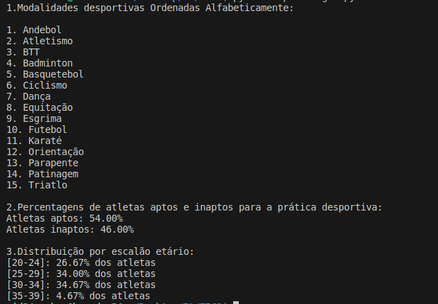

# TPC1: Processar CSV


**Nome:** Gonçalo Araújo

**ID:** A100663


## Descrição 
Neste trabalho de casa tinhamos o objetivo de ler e processar um dataset e fazendo algumas estatistica sobre o mesmo, como ordenar modalidades desportivas alfabeticamente, percentagem de atletas aptos/inaptos e a distribuição dos mesmo por escalões etários. 

## Como executar 

```python3 tp1csvregex.py emd.csv```


**Resultados Obtidos**: 
