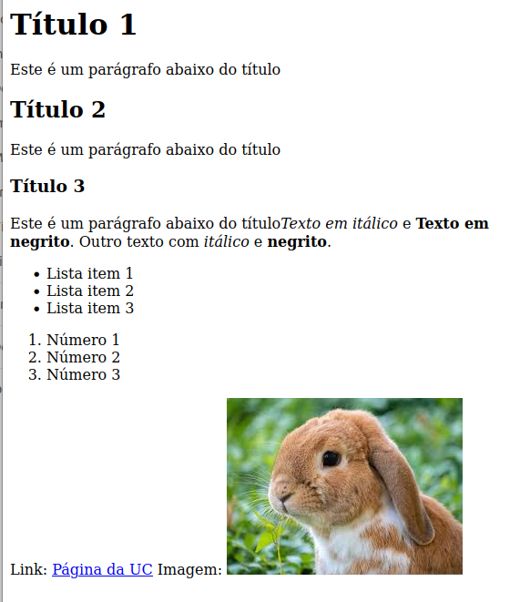

# TPC1: Processar CSV


**Nome:** Gonçalo Araújo

**ID:** A100663


## Descrição 
Neste trabalho de casa tinhamos o objetivo de transformar um decomento markdown para uma pagina Html utilizado expressões regulares.

## Como executar 

```python3 conversormdtohtml.py input.md```


**Resultados Obtidos**: 
